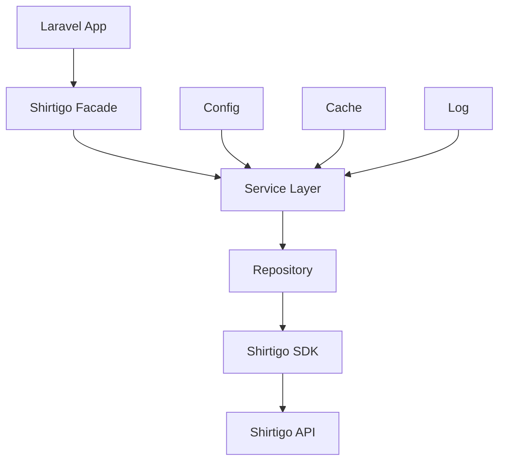

# System Patterns: Laravel Shirtigo Wrapper

## Architektur

### Service Layer Pattern
```php
Shirtigo::orders()->getAll($params)
Shirtigo::products()->create($data)
Shirtigo::designs()->upload($file)
```

### Facade Pattern
```php
use Shirtigo\Facades\Shirtigo;

Shirtigo::orders()->getAll();
```

### Service Provider Pattern
- `ShirtigoServiceProvider` für Laravel-Integration
- Singleton-Binding für API-Client
- Konfigurationspublishing

### Repository Pattern
```php
interface ShirtigoRepositoryInterface
{
    public function orders(): OrderRepository;
    public function products(): ProductRepository;
}
```

## Design Patterns

### Adapter Pattern
- Wrapper um die bestehende Shirtigo SDK
- Laravel-spezifische Anpassungen

### Factory Pattern
- API-Client Factory
- Model Factory für Responses

### Strategy Pattern
- Verschiedene Authentifizierungsstrategien
- Caching-Strategien

## Datenfluss



## Error Handling
- Laravel-spezifische Exceptions
- HTTP-Status-Code-Mapping
- Retry-Mechanismen
- Logging-Integration

## Caching
- Response-Caching
- Konfigurierbare TTL
- Cache-Tags für Invalidation
- Laravel Cache-Integration