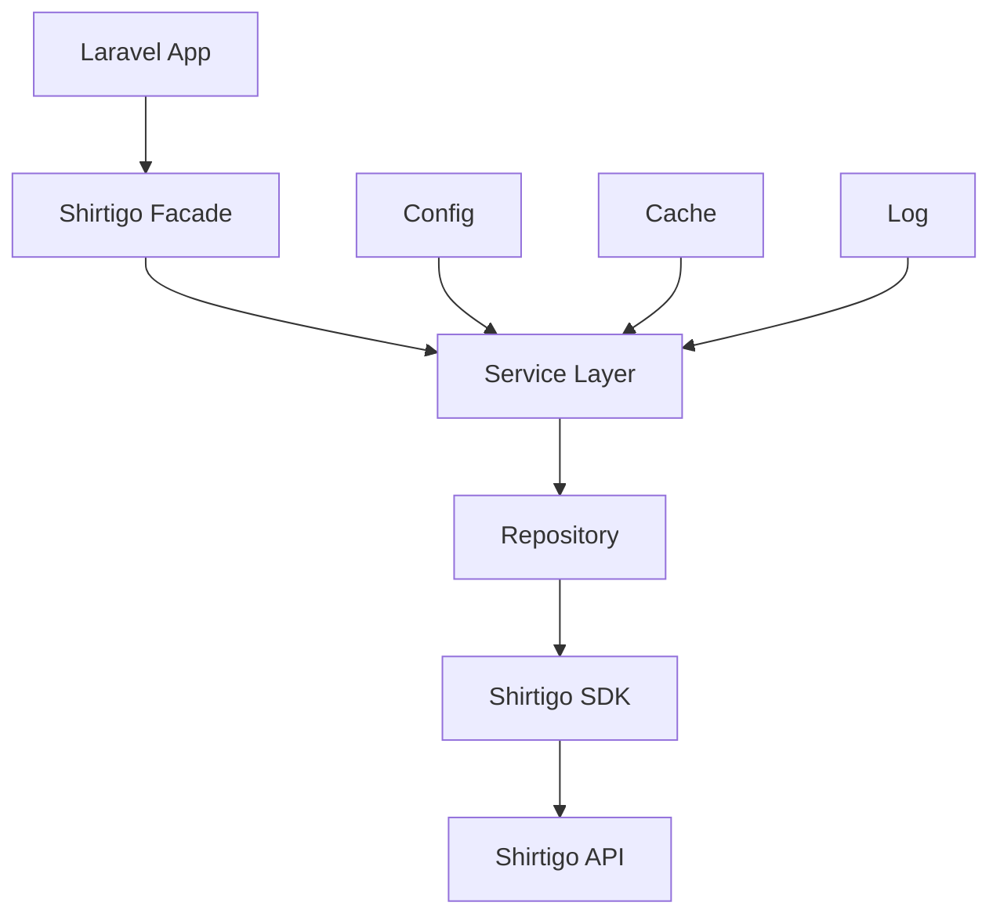

# System Patterns: Laravel Shirtigo Wrapper

## Architecture

### Service Layer Pattern
```php
Shirtigo::orders()->getAll($params)
Shirtigo::products()->create($data)
Shirtigo::designs()->upload($file)
```

### Facade Pattern
```php
use Shirtigo\Facades\Shirtigo;

Shirtigo::orders()->getAll();
```

### Service Provider Pattern
- `ShirtigoServiceProvider` for Laravel integration
- Singleton binding for API client
- Configuration publishing

### Repository Pattern
```php
interface ShirtigoRepositoryInterface
{
    public function orders(): OrderRepository;
    public function products(): ProductRepository;
}
```

## Design Patterns

### Adapter Pattern
- Wrapper around the existing Shirtigo SDK
- Laravel-specific adaptations

### Factory Pattern
- API client factory
- Model factory for responses

### Strategy Pattern
- Different authentication strategies
- Caching strategies

## Data Flow



## Error Handling
- Laravel-specific exceptions
- HTTP status code mapping
- Retry mechanisms
- Logging integration

## Caching
- Response caching
- Configurable TTL
- Cache tags for invalidation
- Laravel cache integration